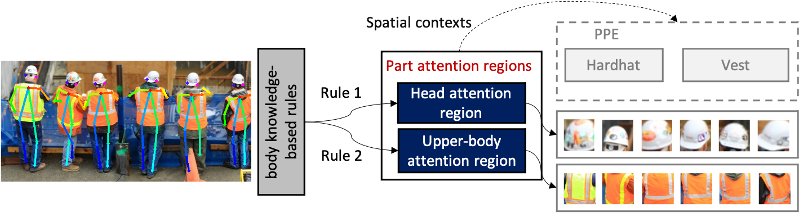
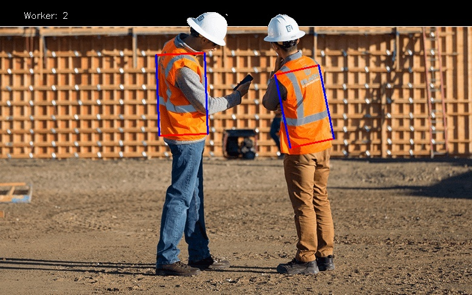

# PPE-Detection-Pose
Pose guided anchoring for detecting proper use of personal protective equipment

## **Table of Contents**

1. [Introduction](#Introduction)
2. [Implementation](#Implementation)
3. [CPPE Dataset](#CPPE-Dataset)
4. [Comparative studies: Pre-trained object detection models](#Comparative-studies-Pre-trained-object-detection-models)
5. [C++ Demo](#C-demo)

## **Introduction**

The repository presents the implementation of vision-based PPE compliances (e.g., hardhats, safety vests) for workers.

<div align="center">
    <br>
    <sup>Overview of the pose-enhanced framework for Non-PPE use recognition
</div>

## **Implementation**

### **Worker pose estimation**

Worker pose estimation mainly follows the work of [OpenPose](https://github.com/CMU-Perceptual-Computing-Lab/openpose) to detect worker body parts as spatial anchors.

  - Download `pose visulization images` for CPPE Dataset from [Google Drive](https://drive.google.com/file/d/1046-CP124UsXfxgDy3sjZ5xl_Dy9BVZ2/view?usp=sharing).

  - Download `pose estimation results` in JSON formats from [Google Drive](https://drive.google.com/file/d/1046-CP124UsXfxgDy3sjZ5xl_Dy9BVZ2/view?usp=sharing).

### **Part attention localization**

The detected keypoints can guide the localization of part attention regions depending on the types of PPE items.

<div align="center">
    <br>
    <sup>Overview of the part attention localization module
</div>

- COCO keypoint output format

```
{0,  "Nose"}, {1,  "Neck"}, {2,  "RShoulder"}, {3,  "RElbow"}, {4,  "RWrist"}, {5,  "LShoulder"}, {6,  "LElbow"}, {7,  "LWrist"}, {8,  "RHip"}, {9, "RKnee"}, {10, "RAnkle"}, {11, "LHip"}, {12, "LKnee"}, {13, "LAnkle"}, {14, "REye"}, {15, "LEye"}, {16, "REar"}, {17, "LEar"}
```
To navigate through these image patches, body knowledge-based rules are defined using detected 2D keypoints to configure the location and size of the objects’ bounding boxes under various workers’ orientations.

<div align="center">
    
    <br>
    <sup>Head attention regions for hardhat recognition (left image) and Upper-body attention regions for safety vest recognition (right image)</sup>
</div>

### **Binary classification for PPE and non-PPE use**

Generally, each worker produces two types of part attention regions: `head attention region` and `upper-body attention region` if their body parts are visible in the image. To recognize PPE instances in the body part attention regions, two classifiers - `hardhat classifier f1(X1)` and `vest classifier f2(X2)`, are constructed.

- Data and weights are available in Google Drive. ([hardhat](https://drive.google.com/file/d/1GxqQNbyyuhadFSK01F0QHZ5WvRG7l6gt/view?usp=sharing)    [vest](https://drive.google.com/file/d/1-GGgf-u1xETEGdySGsWcXwES6cP5Y-y1/view?usp=sharing))

- The following pretrained CNN classifier models are available.

    - VGG-16 ([hardhat](https://drive.google.com/file/d/1ECEbHHs57y8k-33oeCdQgkcl1c1eZ8Ed/view?usp=sharing)   [vest](https://drive.google.com/file/d/1W87MPBAPbPjEqdKXQz30xyinFe8iqRnY/view?usp=sharing))
    - VGG-19 ([hardhat](https://drive.google.com/file/d/1roXzH81zRskxftevzmGEmG4nJ44p-MiY/view?usp=sharing)   [vest](https://drive.google.com/file/d/1m7LBIjvUYzyaHKgTvqVxXqGS2BLmopkT/view?usp=sharing))
    - MobileNet ([hardhat](https://drive.google.com/file/d/1_SmwthECpp5HcMW8BNGRTBPvXUCDmXCq/view?usp=sharing)   [vest](https://drive.google.com/file/d/1MlGkxjP3rcTMTnOZQNhbd7p7DsovFwad/view?usp=sharing))
    - ResNet-18 ([hardhat](https://drive.google.com/file/d/1C3OGPYNU1Gkxa-mUO_ALHdF7jE1HjVID/view?usp=sharing)   [vest](https://drive.google.com/file/d/1h6csdAajN4LnIH6zpWYt81WuUulugPc8/view?usp=sharing))
    - ResNet-34 ([hardhat](https://drive.google.com/file/d/1a1fOAoD2qIqXqtMZjK8_0OYZKRTzUuEc/view?usp=sharing)   [vest](https://drive.google.com/file/d/1eDCufPaCWMMu76SaO5TvwKoWMpKin9NJ/view?usp=sharing))
    - ResNet-101 ([hardhat](https://drive.google.com/file/d/1KbkQrYEUmVNSro34OA2nmQ0UtbUNPxaY/view?usp=sharing)   [vest](https://drive.google.com/file/d/1zCn78C_zBPllDJD_sebpRUAXCgF4qZ3j/view?usp=sharing))
    - ResNet-152 ([hardhat](https://drive.google.com/file/d/1GnCZ5csCxftJZH0eAFMix383RVYMzUna/view?usp=sharing)   [vest](https://drive.google.com/file/d/1OdaBKVdXyXXQqpa7LTInqqW1ENMsrXyj/view?usp=sharing))

<div align="center">
    
    <br>
    <sup>hardhhat recognition(left image) and vest recognition(right image)</sup>
</div>


## **CPPE Dataset**

- Construction Personal Protective Equipment (CPPE) Dataset

  - The proposed `CPPE dataset` consists of 932 images, including 2,747 instances of hardhats, 1,339 instances of safety vests, and 3,428 workers by collecting data from `Pictor-v3 dataset`, `GDUT-HWD dataset`, `Safety helmet wearing detect dataset (SHWD)`, and web-mined images. Data available in [Google Drive](https://drive.google.com/file/d/1046-CP124UsXfxgDy3sjZ5xl_Dy9BVZ2/view?usp=sharing).

- Related public PPE datasets

  - The `Pictor-v3 dataset` contains 774 images for public access. Data available in [Google Drive](https://drive.google.com/drive/folders/19uUR6EJPQzMeK0YpsxRm51wMZzDmcsv6).

  - The `GDUT-HWD dataset` contains 3,174 images, which has been split into 1,587 for training (GDUT-HWD trainval) and 1,587 for testing (GDUT-HWD test). It contains 18,893 instances. Data available in [Baidu Yun](https://pan.baidu.com/share/init?surl=_Jj56B05YpUv5iLB9JMb4g) (pwd:dstk).
  
  - The `SHWD` contains 7581 images with 9,044 safety helmet wearing objects(positive) and 111,514 normal head objects(not wearing or negative). Data available in [Google Drive](https://drive.google.com/open?id=1qWm7rrwvjAWs1slymbrLaCf7Q-wnGLEX).
  
## **Comparative studies: Pre-trained object detection models**

The following pretrained models on the CPPE dataset are available.

- [YOLO-v3](https://drive.google.com/file/d/1WR_HSEBSVSWz1_FpV5RxiGmDGpXFnhNf/view?usp=sharing)

- [SSD-300](https://drive.google.com/file/d/1RSyJk-Ksugs_rByTjr_qW0C4KWV4GYfe/view?usp=sharing)

- [Faster R-CNN](https://drive.google.com/file/d/1rqveCR3d69eT3fEET4ubx0n3GD-aayjA/view?usp=sharing)


## **C++ Demo**

The python demo is used for the quick results preview and test. We will consider compiling the codes in c++ demo in future work. 

## **Acknowledgements**

https://github.com/CMU-Perceptual-Computing-Lab/openpose

https://github.com/open-mmlab/mmpose

GDUT-HWD Dataset credits: https://github.com/wujixiu/helmet-detection

Pictor-v3 dataset credits: https://github.com/ciber-lab/pictor-ppe#pre-trained-models

SHWD dataset credits: https://github.com/njvisionpower/Safety-Helmet-Wearing-Dataset
